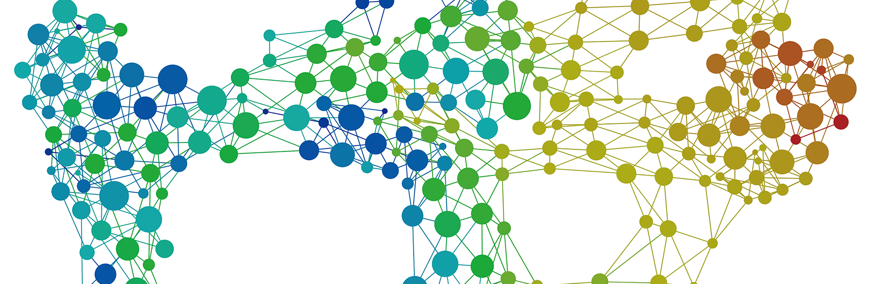

# Homework5_Group-34
Group composed by: Eleonora Barocco, Mahtab Fotovat, Fabio Montello, Farid Rasulov

## Homework 5 - Visit the Wikipedia hyperlinks graph!

In this assignment we perform an analysis of the Wikipedia Hyperlink graph. In particular, given extra information about the categories to which an article belongs to, we are curious to rank the articles according to some criteria.

For this purpose we use the Wikipedia graph released by the SNAP group.
## What you will find in our repository:
Our repository is simply composed by one document:
 -  `Homework5_Group-34.ipynb` which is the file where all the analysis on the graph from the data has been made.
 
Furthermore inside the folder data, there are some illustrations used in the project.
The data generated from the program, a serie of files which stores the node distances for each category, has not been uploaded since was around 2.86Gb of files.
